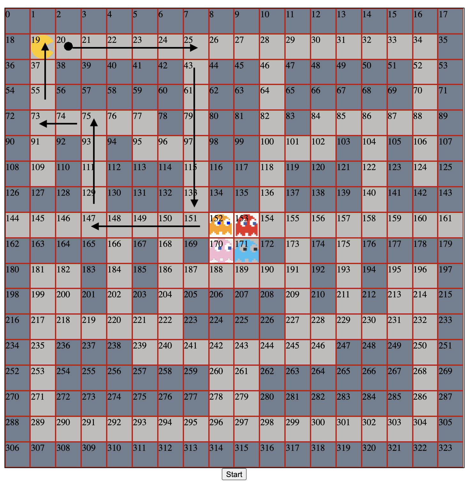
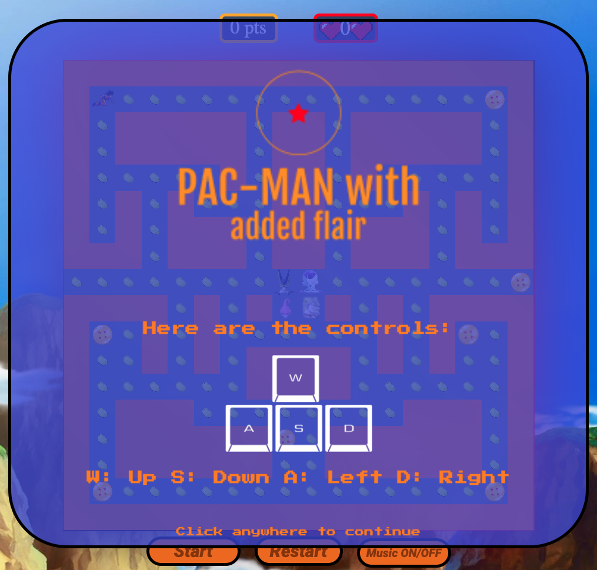
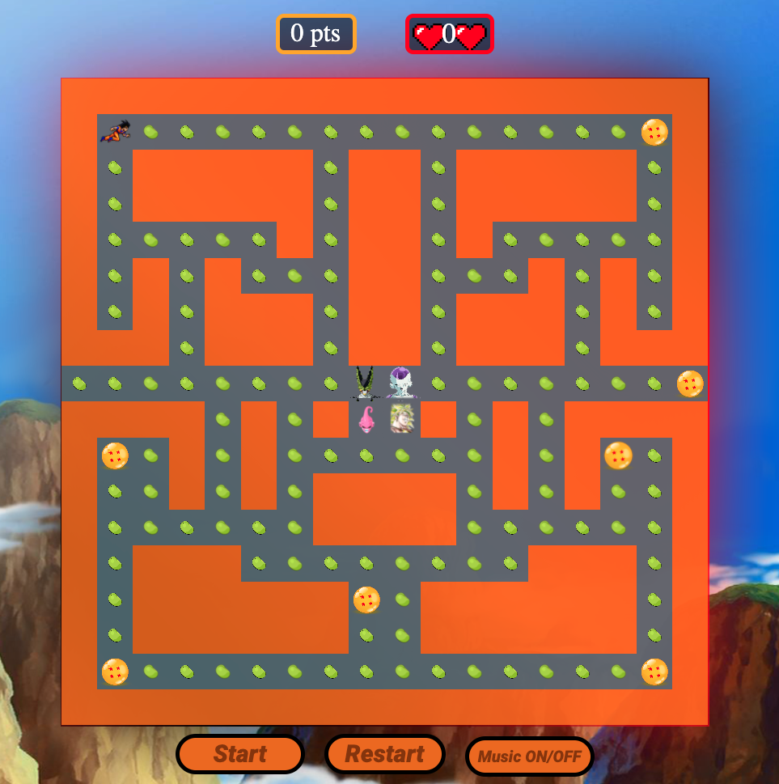
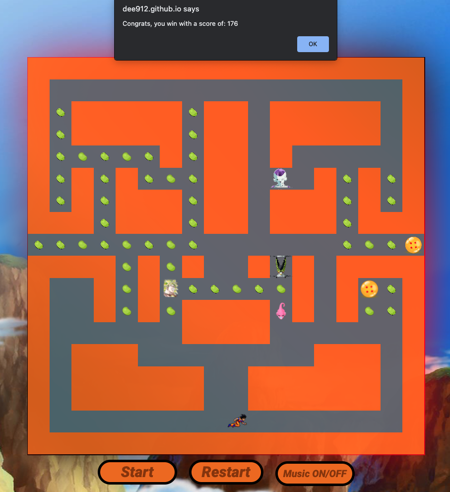

# PAC-MAN with added flair

## Overview

The project here is my first during the Software Engineering Immersive course at GA and my first coding project in general. This assignment was to build a grid-based game using **HTML, CSS and JavaScript**. It was an **individual** project completed within **one week**.

My cohorts and I were given a selection of games to choose from so I decided on the classical and personal favourite, PAC-MAN. I created a rendition of the game in a Dragon Ball Z theme. **I will be referring to characters as in the original game** as this is easier to understand.

You can launch the game directly from  [**here!**](https://dee912.github.io/project-1/)

## Brief

* Render a game in the browser.
* Design logic for winning.
* Include separate HTML / CSS / JavaScript files.
* Follow KISS (Keep It Simple Stupid).
* Use JavaScript for DOM manipulation.
* Deploy your game online, where the rest of the world can access it.
* Use semantic markup for HTML and CSS (adhere to best practices).

## Technology used 

* HTML
* CSS
* JavaScript
* Git and GitHub
* Google Fonts
* Image editor

## Approach

### Grid set-up

* For the grid I set a const variable for the width I wanted and then used a for loop to push the newly created divs into an empty array representing the cells.

  * I used this method as it allowed me to freely play around with the size of my grid and decided on what was right for me.

  ```JavaScript
  const width = 18
  const cells = []

  for (let i = 0; i < width ** 2; i++) {
    const div = document.createElement('div')
    grid.appendChild(div)
    div.innerHTML = i
    div.style.width = `${100 / width}%`
    div.style.height = `${100 / width}%`
    cells.push(div)
  }
  ```
* Elements such as the wall, path and food were also represented by hard coded array and classes added using a `forEach` array method, in hindsight this would be my approach now which will be discussed further down in the Lessons learned/ Alternative approach section.

  * The reasons for this was due to not foreseeing future issues I would run into and thinking it to be the fastest way.

```JavaScript
movable.forEach(walk => {
  cells[walk].classList.add('path')
})

food.forEach(item => {
  cells[item].classList.add('food')
})

dragonBalls.forEach(ball => {
  cells[ball].classList.add('dragonballs')
})

blocks.forEach(barrier => {
  cells[barrier].classList.add('wall')
})
```

* For my PAC-MAN and ghosts I just set their starting positions and then added classes to those cells.

```JavaScript
let gokuPos = 19
const ghosts = {
  clydePos: 152,
  blinkyPos: 153,
  pinkyPos: 170,
  inkyPos: 171,
}

cells[gokuPos].classList.add('pacman')
cells[ghosts.clydePos].classList.add('clyde')

```

### Random movements

* For my random movements I decided to place all possible movements into an array and access that array using a random number each time a ghost hit a wall element. 
* I went for this approach as it kept my logic pretty simple and it was easy to apply to all ghosts after testing on Clyde.

```JavaScript

    setInterval(() => {

    let clydeMove = null
    
    while (!clydeMove) {
      clydeMove = ghostDirection[Math.floor(Math.random() * ghostDirection.length)]
      console.log(clydeMove)
    }
    
    if (movable.includes(ghosts.clydePos + clydeMove)) {
      cells[ghosts.clydePos].classList.remove('clyde')
      ghosts.clydePos += clydeMove
      cells[ghosts.clydePos].classList.add('clyde') 
    
    pacManReset()
  }, 300)
```

### Collision detection

* Collision detection for PAC-MAN went through a few stages, first all the border walls were avoided using a calculation but I soon realised that once I add in my internal walls the maths functions wouldn't be of any use to them.
* This is where the idea of setting the moveable and blocks arrays above came from. Once they had been set I was able to just plug it into my keydown event listener.

```JavaScript
  document.addEventListener('keydown', (e) => {
    livesLeft.innerHTML = lives

    //pacman controls

    const key = e.key
    if (key === 's' && movable.includes(gokuPos + width)) { 
      cells[gokuPos].classList.remove('pacman')
      gokuPos += width
      cells[gokuPos].classList.add('pacman')
    }
```

* For the tunnel I hit another bug which was when PAC-MAN walked through the tunnel on either end he would end up stuck in the wall on the opposite side or he wouldn't walk through at all.
* So to resolve this I made it possible for PAC-MAN to move even though the next block would be a wall and then just reset his position immediately, this made for a smooth transition that looked as though he was just walking through.

```JavaScript
    //tunnel at centre of the map
    if (gokuPos === 162) {
      cells[gokuPos].classList.remove('pacman')
    gokuPos = 144
      cels[gokuPos].classList.add('pacman')
    } else if (gokuPos === 143) {
      cells[gokuPos].classList.remove('pacman')
      gokuPos = 161
      cells[gokuPos].classList.add('pacman')
    }
```

### Power up/ Dragon Balls

* As time was a little short once I got to the power ups I went for an efficient quick way of making them work however not the most condensed way.
* I went for this approach as I still wanted the function to work but also needed to improve other persistent issues. 

```JavaScript
    dragonBalls.forEach(item => {
      if (gokuPos === item) {
        cells[item].classList.remove('dragonballs')
        score += 5
      }
    }) 
```

```JavaScript
function cellReset() {
  if (gokuPos === ghosts.clydePos) {
    cells[ghosts.clydePos].classList.remove('clyde')
    ghosts.clydePos = 152
    score += 10
    cells[ghosts.clydePos].classList.add('clyde')
  }
}
```

* Once I wrote the above function I just called them in the below setInterval. This kept it looking more neat compared to my setInterval for my ghosts movement which is cluttered.
* After PAC-MAN ate one of the power ups there will be a 10s period where the ghosts can be eaten and the score increased by 10 pts.

```JavaScript
  setInterval(() => {
    if (dragonBalls.includes(gokuPos)) {
      cellReset()
      freezaReset()
      buuReset()
      brolyReset()
    }
  }, 10000)
```
## Screenshots

### Before getting the idea of how to move my ghost randomly I was going to hard code in a path, I was setting the movements here in an array which then sparked the idea for how I got my ghosts to move.

### Splash screen

### Start screen

### Win screen

### Lose screen

## Bugs
#### With this being my first project I was surprised by how bugs came about and even as I may blame the code it was always due to minor human errors.

### Score bug:
* At present my score will increase simply from keying down.
* After thinking about it I understand it is because I hard coded my food path so even if there is no food class since the cell is called food the game will always recognise keying down on those cells means a score increase.
* Also my end game functions are not as well written as I would have liked it to be and instead kicks off an alert saying the player has won at a score of 176 as this was the amount of food cells I had at the time of writing it.

### Lives bug:
* Currently my life display up top only begins to display the live available after the first keydown.
* I realise in hindsight that is due to calling the Lives.innerHTML in the keydown event listener.
## Wins
* Getting my ghosts to move randomly was a big achievement for my self.
* The overall style of the project.

## Lessons learned/ Alternative approaches
### Map setup
* For the map I would look into instead of hardcoding in each style of path, moveable, food etc., to instead set up the map with an assigned number.
* A barrier/wall would be labeled 1, food would be labeled 2 which wouldn't clash with the block and dragon balls would be labeled 3.
* Labeling them this was in an array would then allow me to wrap them to form the grid.

### Assistance
* Asking for help was a big learning curve, it's rather easy to get caught up in your own issue and forget there are Teachers and TAs around to help where needed.
* By welcoming help more often I know I could have turned out a much better product and will ask for help where needed in the future.

## Potential future features
* New level once the current level has been completed.
* Smart moving ghosts depending on PAC-MAN's position.
* A working scoreboard.
* Leaderboard included.

## References
### Very grateful for the following resources:

#### Characters
* Goku: https://bit.ly/3hjJr1w
* Cell: https://bit.ly/3uJTqRq
* Freeza: https://bit.ly/3vVNd56
* Buu: https://bit.ly/3tEyoCj
* Broly: https://bit.ly/3fccWiN
#### Food
* Soy bean: https://bit.ly/2Q7zLvC
* Dragon Ball: https://bit.ly/33CQ0nw
#### Theme
* Main background: https://bit.ly/3tEa5Vc
* Heart: https://bit.ly/2SxTy8j
